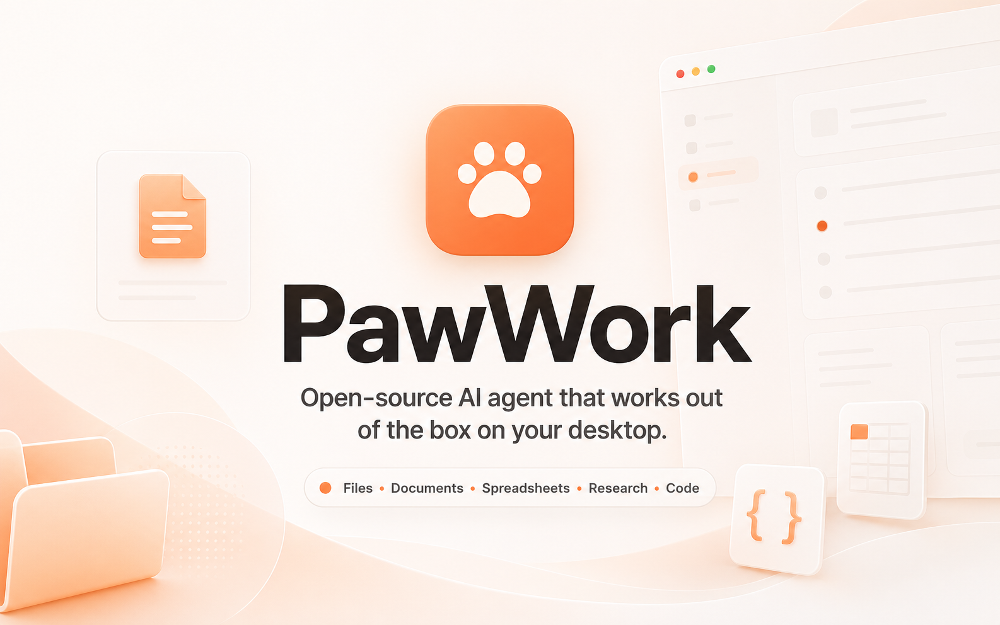

# 爪印 PawWork

**爪印是一个免费、开源的桌面 AI 智能体，支持 macOS 和 Windows，能处理文档、表格、研究、写作、代码等日常桌面工作，接入 75+ AI 模型。**

Codex App 和 Claude Cowork 的开源替代方案。自带免费额度，也支持自带 API Key，兼容所有主流模型，包括 ChatGPT OAuth 登录。

[](LICENSE)
[](https://github.com/Astro-Han/pawwork/releases/latest)
[](https://github.com/Astro-Han/pawwork/releases/latest)

[English](README.md) · [官网](https://pawwork.ai)

爪印 PawWork 面向真实的桌面工作场景，在一个极简、优雅的界面里，帮你处理文档、表格、资料整理、写作、代码和本地文件。

无需安装复杂的工具链，无需提前准备 API 密钥，也无需购买付费模型账号。爪印 PawWork 内置来自 OpenCode Zen 的免费额度、内置搜索和任务卡片，下载打开就能开始。



## 为什么选择爪印 PawWork

爪印 PawWork 不是把聊天框换一个外壳，也不是只面向程序员的命令行工具。它想解决的是更常见的问题：你手里有文件、表格、资料、代码或一堆零散信息，希望 AI 智能体直接帮你推进工作。

- **少配置：** 下载应用，选择工作文件夹，就可以先用 OpenCode Zen 提供的免费额度开始。
- **处理真实桌面工作：** 面向本地文件、文档、表格、笔记、网页资料、代码和最终产物。
- **任务卡片：** 不从空白输入框开始，而是用具体任务帮你更快上手。
- **模型选择更多：** 支持 OpenAI、Claude、DeepSeek、Gemini、Kimi、GLM、OpenAI 兼容提供商，以及可用的 Coding Plan。
- **开源和可控：** 你可以查看它怎么工作，选择自己的工作文件夹，连接自己信任的账号，并在关键步骤继续前进行检查。

## 产品对比

| | 爪印 PawWork | Codex App | Claude Desktop (Cowork) |
|---|---|---|---|
| 开源 | 是（Apache-2.0） | 否 | 否 |
| 自带 API Key | 支持 75+ 提供商 | 仅 OpenAI | 仅 Anthropic（可通过网关接其他） |
| ChatGPT OAuth | 支持 | 不支持 | 不支持 |
| 免费无需订阅 | 有（OpenCode Zen） | 有限（ChatGPT Free） | 无（需 Pro $20/月） |
| 桌面应用 | macOS + Windows | macOS + Windows | macOS + Windows |
| 本地文件访问 | 完整工作区 | 默认沙箱 | 用户选择的文件夹 |
| 本地模型 | 支持（Ollama、LM Studio 等） | 仅 CLI 支持（Ollama） | 通过网关（Requesty） |
| Office 文件处理 | 支持（Word/Excel/PPT） | 不支持 | 不支持 |
| 面向非技术用户 | 是（任务卡片，无需终端） | 面向开发者 | 知识工作 + 编程 |

## 你可以让爪印 PawWork 做什么

### 文档和表格

- 从发票中提取关键信息，整理成可以检查的表格草稿
- 汇总一份 CSV，并生成简短报告
- 合并几份 PDF，并整理输出文件
- 根据会议记录和附件起草周报

### 资料和写作

- 对比几个产品页面，整理成决策建议
- 搜索网页资料，并保留可追溯来源
- 整理会议记录，起草公告草稿
- 改写零散素材，生成结构清晰的文档

### 代码和技术工作

- 看懂一个代码项目，并说明应该从哪里改
- 审查一个 PR，总结主要风险
- 结合日志和源码排查 API 报错
- 根据一句自然语言需求做一个小工具

## 工作方式

1. 选择一个工作文件夹。
2. 选择任务卡片，或直接用日常语言描述你想做什么。
3. 爪印 PawWork 根据任务调用文件、工具、模型和搜索。
4. 你检查执行步骤、输出内容和生成文件，再决定如何使用结果。

## 模型、账号和搜索

爪印 PawWork 内置来自 OpenCode Zen 的免费额度，也内置带免费额度的网页搜索。你不需要先准备自己的 API 密钥才能开始。

如果你需要更多模型选择或更强控制权，可以连接自己的模型账号。爪印 PawWork 支持 API 密钥，也支持可用提供商的 OAuth 登录、OpenAI 兼容提供商和可用的 Coding Plan，包括 OpenAI、Claude、DeepSeek、Gemini、Kimi、GLM 等。

## 下载

从 [GitHub Releases](https://github.com/Astro-Han/pawwork/releases/latest) 下载最新的 macOS 和 Windows 版本。

- **macOS：** 下载 `.dmg`，release 构建已完成 Apple 签名和公证。
- **Windows：** 下载 Windows x64 `.exe`。该版本目前尚未签名，首次打开时可能会出现 SmartScreen 提示。

爪印 PawWork 还在快速迭代。每个版本的更新内容可以在发布说明中查看。

## 从源码运行

需要 [Bun](https://bun.sh) v1.2+。

```bash
git clone https://github.com/Astro-Han/pawwork.git
cd pawwork
bun install
bun run dev:desktop
```

## 基于 OpenCode

爪印 PawWork 基于 [OpenCode](https://github.com/anomalyco/opencode) fork 构建。我们保留智能体底座，重建桌面产品体验，并加入爪印 PawWork 的任务入口、模型默认值和日常工作场景。

感谢 OpenCode 项目和社区。

爪印 PawWork 内置 iOfficeAI 的 [OfficeCLI](https://github.com/iOfficeAI/OfficeCLI)，用于在本地处理 Word、Excel 和 PowerPoint 文件。感谢 iOfficeAI 以 Apache-2.0 开源 OfficeCLI。

## 常见问题

**爪印 PawWork 免费吗？**
免费。爪印内置 OpenCode Zen 免费额度和网页搜索，下载打开就能用，不需要先准备 API Key。如果想用更多模型，可以接入自己的账号。

**支持哪些模型？**
OpenAI（包括 ChatGPT Plus/Pro OAuth 登录）、Claude、DeepSeek、Gemini、Kimi、GLM，以及任何 OpenAI 兼容的提供商，共 75+ 提供商，也支持 Ollama、LM Studio 等本地模型。

**能处理本地文件吗？**
可以。爪印是桌面原生应用，对你选择的工作文件夹有完整的读写权限，可以处理文档、表格、PDF、代码项目和生成文件。

**支持哪些文件格式？**
PDF、Word (.docx)、Excel (.xlsx)、PowerPoint (.pptx)、CSV、Markdown、纯文本、图片和代码文件。Office 文件处理由内置的 OfficeCLI 提供。

**支持哪些平台？**
macOS（Apple Silicon 和 Intel，已签名公证）和 Windows x64。

**是开源的吗？**
是，Apache-2.0 协议。可以在 [GitHub](https://github.com/Astro-Han/pawwork) 查看源码、从源码构建、参与贡献。

## License

[Apache License 2.0](LICENSE)
